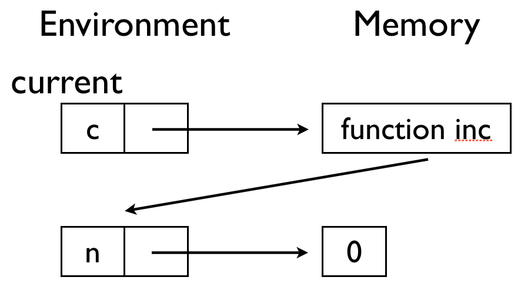
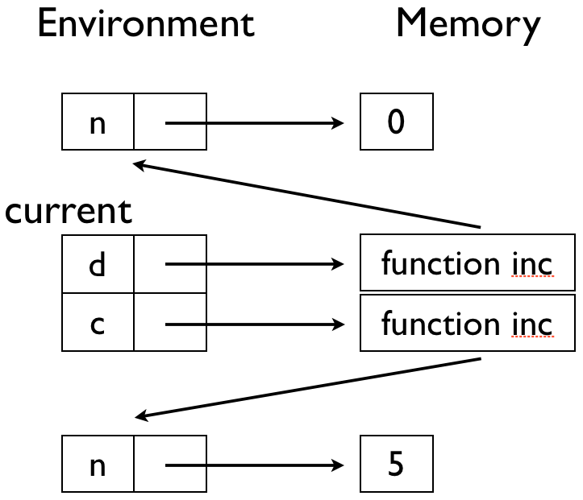
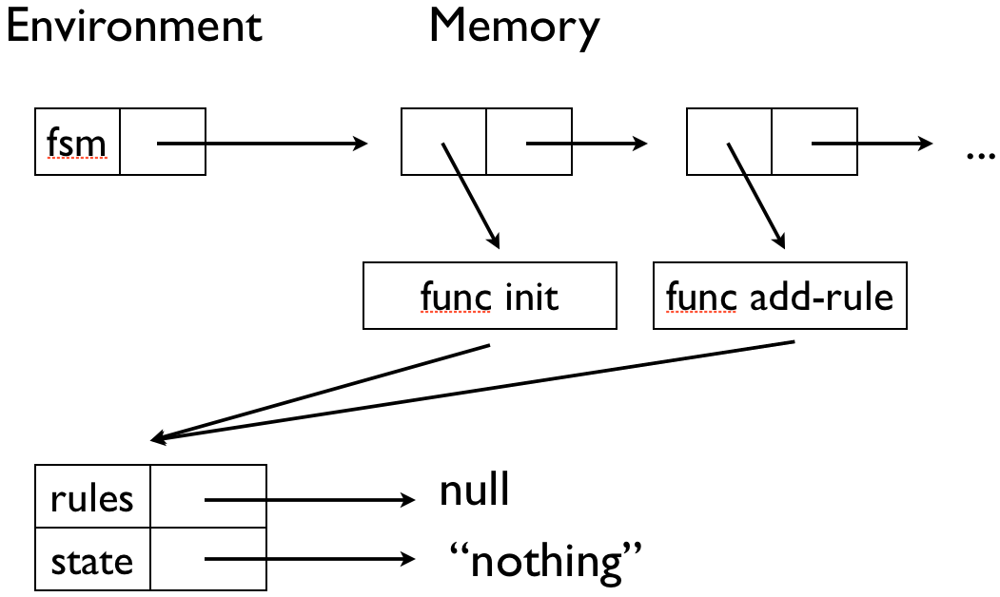

# 프로그래밍의 원리 실습 #

2013년 10월 30일 (수) 16:00-17:50
조교 [조성근](http://ropas.snu.ac.kr/~skcho), [강지훈](http://ropas.snu.ac.kr/~jhkang)

실습을 통해 환경과 메모리 모델을 익혀봅시다.

### 환경과 메모리 ###

환경은 프로그램에서 정의된 이름과 그 이름이 가리키는 주소 쌍의
목록입니다. 메모리는 주소와 그 주소에 저장된 값 쌍의 목록입니다. 예를
들어보겠습니다. 다음 그림의 출처는 교수님 강의록 3입니다.


첫번째 환경에서 ```x```가 가리키는 주소가 있고, 메모리의 이 주소에는 값
```1```이 들어있습니다. 또 ```y```가 가리키는 주소가 있고, 메모리의 이
주소에는 값 ```2```가 들어있습니다.

세번째 환경에서 ```y```가 가리키는 주소가 있고, 메모리의 이 주소에는
쌍(```cons```)이 들어있는데, 첫번째(```car```)에는 2가,
두번째(```cdr```)에는 또 다른 쌍을 가리키는 주소가
들어있습니다. 그림에서 보면, 이 주소는 네번째 환경에서 ```x```가
가리키는 주소와 같음을 알 수 있습니다.

### 카운터 ###

수업시간에 배웠고 또 위에서 복습한 환경과 메모리를 염두에 두고, 다음
[카운터 프로그램](counter.rkt)를 보세요. 환경과 메모리를 실제적으로
이해할 수 있는 좋은 예제입니다.

```create-counter```는 함수를 출력으로 내줍니다. 그 함수는 내부에
저장된 ```n```을 하나 증가시키고 출력합니다. ```c```를 정의한 후 환경과
메모리는 다음과 같습니다. 현재 환경은 "current"라고
표시했습니다. 참고로, 함수가 값이 되면(```c```가 가리키는 주소의 값) 그
함수가 실행될 때 사용할 환경을 메모리에 저장합니다.



또 ```d```를 정의한 후 환경과 메모리는 다음과 같습니다.



이제 왜 프로그램이 주석에 적혀있는대로 동작하는지 이해하실 수
있을겁니다. ```c```를 실행할 때와 ```d```를 실행할 때, ```n```에 다른
주소가 들어가기 때문에, 다른 주소의 값에 1을 더하고 출력하는 것을 볼 수
있습니다.

### 또 다시 유한 상태 기계 ###

지난 실습시간과 지지난 실습시간에 구현한 자판기를 또 다시
구현해봅시다. 이번에는 대부분의 구현이 제공되어 있고, 일부만 채워
넣으면 됩니다. 그 일부는 환경과 메모리에 대해 이해하셨다면 쉽게 채워
넣을 수 있습니다.

[뼈대코드](fsm.rkt)를 참고하시고, ```'TODO``` 부분을 채워
넣으세요. 코드를 실행했을 때 ```#t```가 나와야 합니다.

유한 상태 기계는 지난 실습과 마찬가지로 **물건**임을 유의하세요. 하지만
지난 실습시간과는 달리, 유한 상태 기계를 만들어내는 함수
```create-fsm```이 있습니다. 예제를 보시면 두 개의 유한 상태 기계가
만들어집니다. 만들어진 두 유한 상태 기계가 각자 잘 동작해야 합니다.

또 구현을 하기 전후에, 코드를 실행시키면 환경과 메모리가 어떻게
변해갈지 생각해봅시다. ```create-fsm```을 한 직후 다음과 비슷한 환경과
메모리가 될 것입니다.


