# How to Submit Homeworks and Review Others' Homeworks

We will use [crowdgrader][] as a homework submission system.  The
evaluation process is as follows.

1. submit homeworks
2. review others' homeworks
3. evaluate others' reviews of my homeworks
4. check my grade

## Submit homeworks

1. Login with Google account at [crowdgrader][].

2. Click `SUBMIT > Submit your solutions`.

  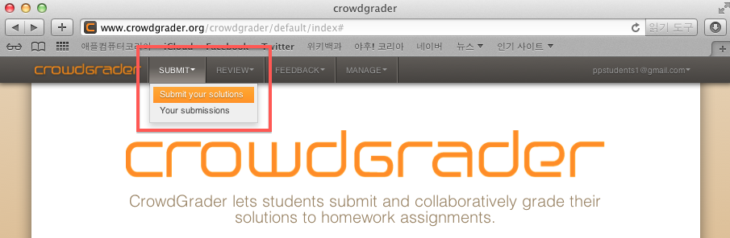

3. Click `SUBMIT` button of a problem of which you will submit an
answer.

  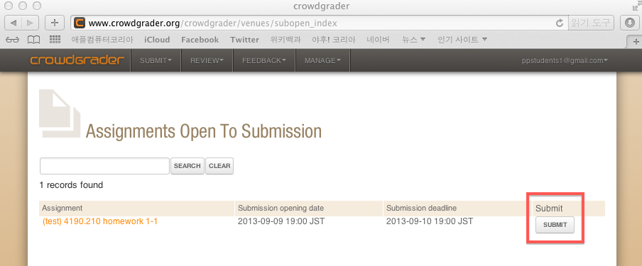

4. Upload your answer and click `SUBMIT` button.

  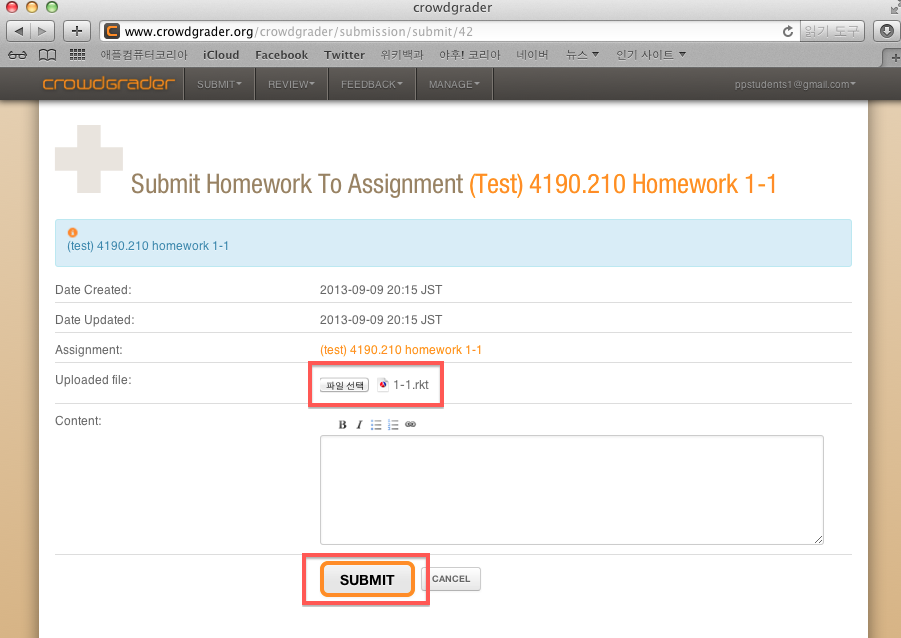

## Review others' homeworks

1. Login with Google account at [crowdgrader][].

2. Click `REVIEW > Your reviewing duties`.

  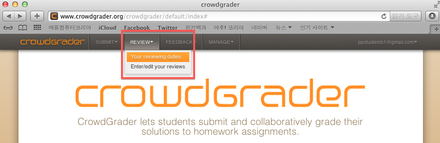

3. Click `ACCEPT REVIEWING TASK` button of a problem of which you will
review an answer.

  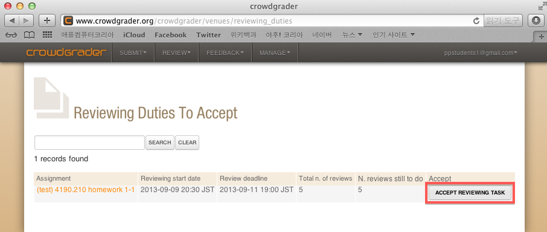

4. Download an answer by clicking `DOWNLOAD ATTACHMENT`, and click
`ENTER/EDIT REVIEW`.

  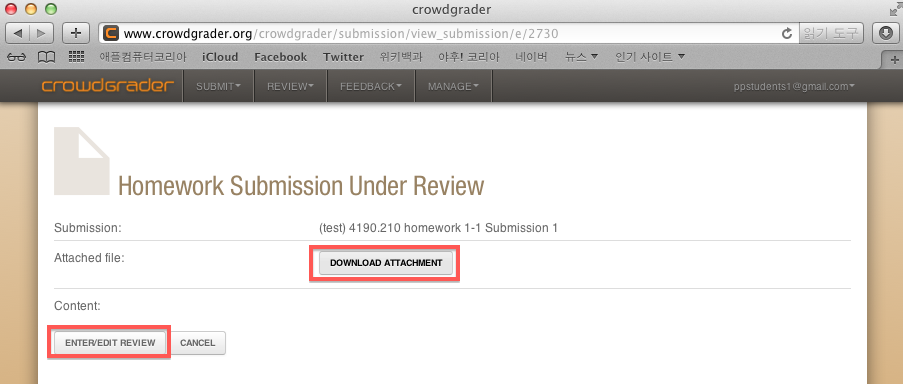

5. Fill in `Grade` with **any number** and `Review` with comments, and
click `SUBMIT`.

  **The numbers in the `Grade` box do not affect grade.**

  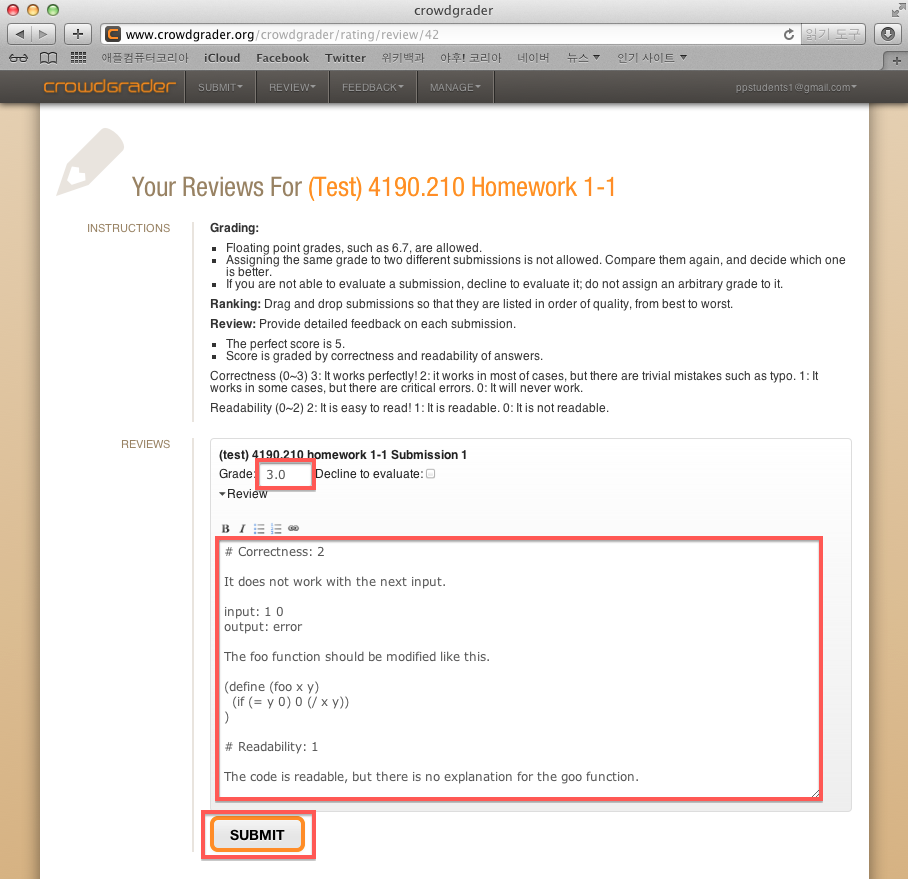

  ### Order of reviewed answers
  
  Before clicking `SUBMIT`, all of graded answers should be sorted in
  decreasing graded order.  If they are not, you will encounter the
  next error message.  Please, sort the answers by dragging before
  clicking `SUBMIT`.
  
  If there are two answers that have the same score, change the score
  to any other number and rearrange them in decreasing graded order.

  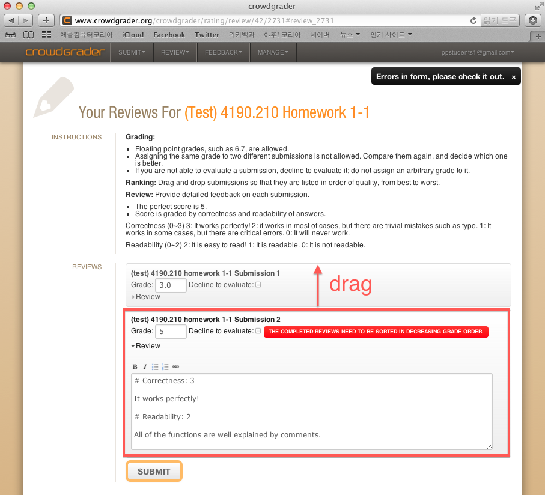
  
  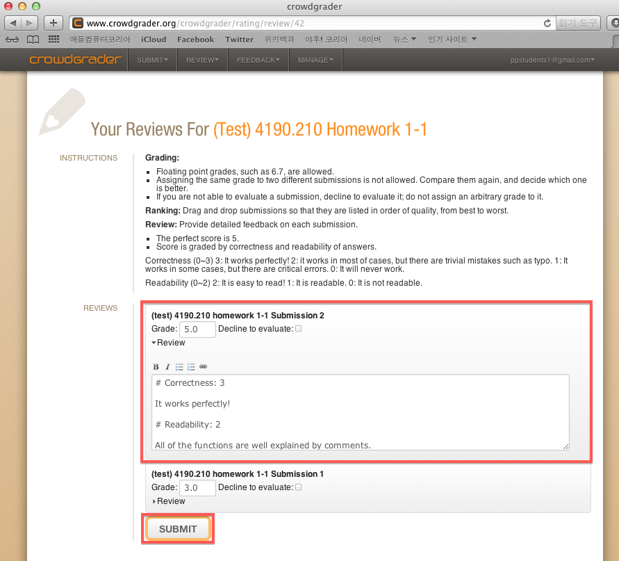

## Evaluate others' reviews of my homeworks

1. Login with Google account at [crowdgrader][].

2. Click `FEEDBACK > Your submissions`.

  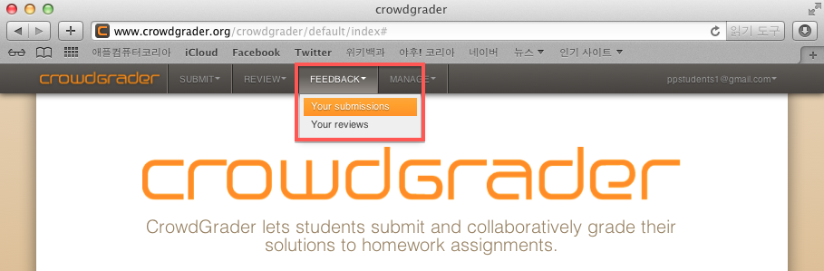

3. Click `VIEW` of a problem of which you will evaluate others'
reviews.

  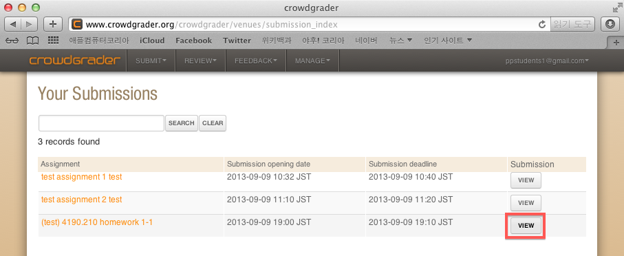

4. Click `GIVE FEEDBACK` of a review you will evaluate.

  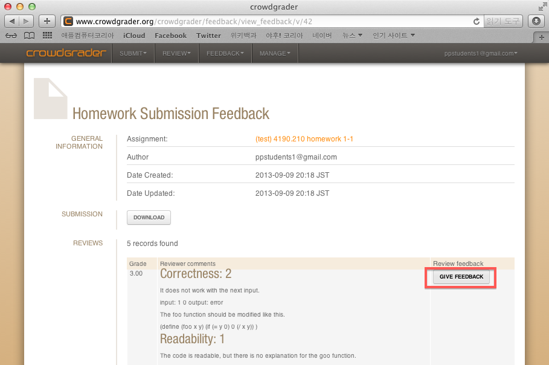

5. Evaluate the review by selecting `Review feedback`, and click
`SUBMIT`.

  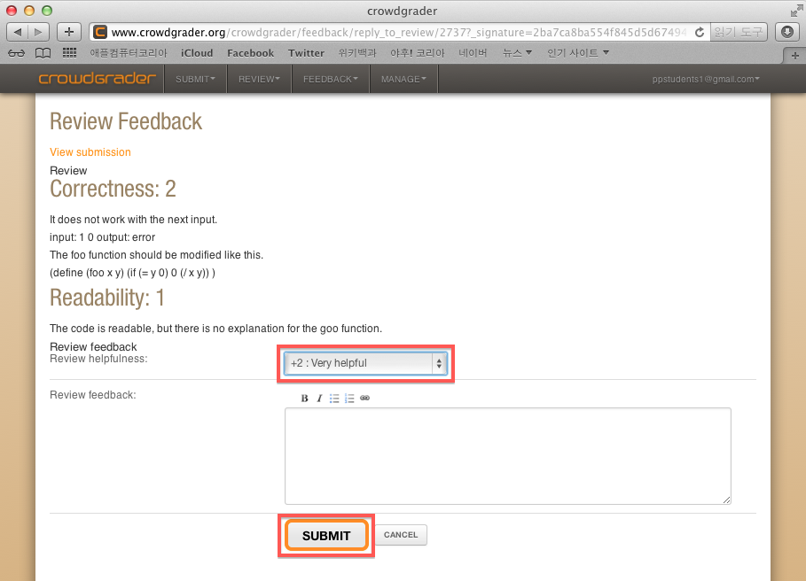

## Check my grade

You can check your grade
[Web Board](https://ropas.snu.ac.kr/phpbb/viewforum.php?f=30).

# About crowdgrader

* [MIT Technology Review](http://www.technologyreview.com/view/519001/first-trial-of-crowdsourced-grading-for-computer-science-homework/?utm_campaign=socialsync&utm_medium=social-post&utm_source=facebook)
* [Paper](http://arxiv.org/abs/1308.5273)

[crowdgrader]: http://www.crowdgrader.org/
