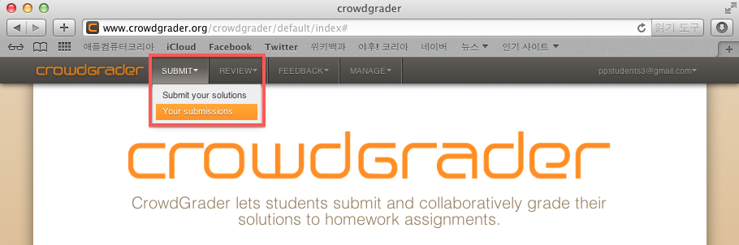
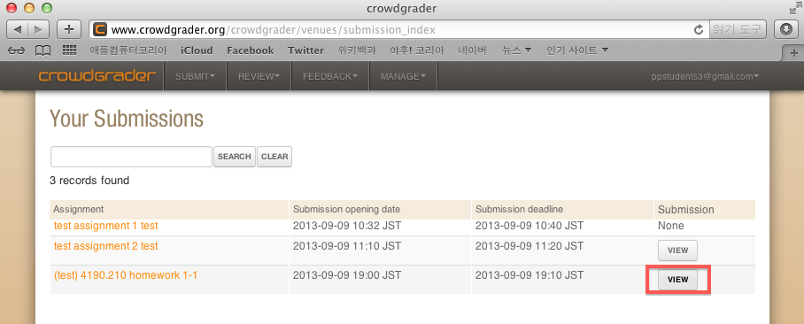
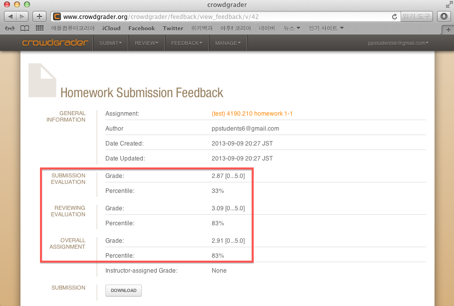

# How to Submit Homeworks and Review Others' Homeworks

We will use [crowdgrader][] as a homework submission system.  The
evaluation process is as follows.

1. submit homeworks
2. review others' homeworks
3. evaluate others' reviews of my homeworks
4. check my grade

## Submit homeworks

1. Login with Google account at [crowdgrader][].

2. Click `SUBMIT > Submit your solutions`.

  

3. Click `SUBMIT` button of a problem of which you will submit an
answer.

  

4. Upload your answer and click `SUBMIT` button.

  

## Review others' homeworks

1. Login with Google account at [crowdgrader][].

2. Click `REVIEW > Your reviewing duties`.

  

3. Click `ACCEPT REVIEWING TASK` button of a problem of which you will
review an answer.

  

4. Download an answer by clicking `DOWNLOAD ATTACHMENT`, and click
`ENTER/EDIT REVIEW`.

  

5. Fill in `Grade` and `Review`, and click `SUBMIT`.

  

  ### How to make grade and review
  
  The perfect score is 5, and it is formed with correctness score 3,
  readability score 2.
  
  Correctness score is graded as follows.
  
  * 3: It works perfectly!
  * 2: It works in most of cases, but there are trivial mistakes such
    as typo.
  * 1: It works in some cases, but there are critical errors.
  * 0: It will never work.

  Readability score is graded as follows.
  
  * 2: It is easy to read!  
  e.g.) All defined functions are easy to understand by well-explained
  comments.
  * 1: It is possible to read.  
  e.g.) All used function/variable names are intuitive.
  * 0: It is not readable.  
  e.g.) There is no explanation about defined functions and used
  function/variable names are not intuitive.

  ### Order of graded answers
  
  Before clicking `SUBMIT`, all of graded answers should be sorted in
  decreasing graded order.  If they are not, you will encounter the
  next error message.  Please, sort the answers by dragging before
  clicking `SUBMIT`.
  
  
  
  

  If there are two answers that have the same score, you have two
  choices.
  
  * Increase **0.1** point of **better** answer, or
  * Decrease **0.1** point of **worse** answer.
  
## Evaluate others' reviews of my homeworks

1. Login with Google account at [crowdgrader][].

2. Click `FEEDBACK > Your submissions`.

  

3. Click `VIEW` of a problem of which you will evaluate others'
reviews.

  

4. Click `GIVE FEEDBACK` of a review you will evaluate.

  

5. Evaluate the review by selecting `Review feedback`, and click
`SUBMIT`.

  

## Check my grade

1. Login with Google account at [crowdgrader][].

2. Click `SUBMIT > Your submissions`.

  

3. Click `VIEW` of a problem you will check.

  

4. `SUBMISSION EVALUATION` is the score of your answer, `REVIEWING
EVALUATION` is the score of your reviews, and `OVERALL ASSIGNMENT` is
the overall score in which the reviewing score is reflected 20%.

  

# About crowdgrader

* [MIT Technology Review](http://www.technologyreview.com/view/519001/first-trial-of-crowdsourced-grading-for-computer-science-homework/?utm_campaign=socialsync&utm_medium=social-post&utm_source=facebook)
* [Paper](http://arxiv.org/abs/1308.5273)

[crowdgrader]: http://www.crowdgrader.org/
